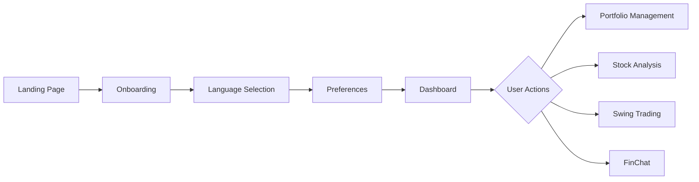

# QuoantB Application Analysis Report

## Executive Summary

QuoantB is an AI-powered investment platform built with Next.js 15.4.5, TypeScript, and React 19. The platform uses multiple AI agents modeled after legendary investors to analyze stocks and identify trading opportunities. While the application has a solid foundation and innovative features, there are several areas requiring improvement for production readiness.

## Application Architecture

### Tech Stack
- **Framework**: Next.js 15.4.5 with App Router and Turbopack
- **UI**: shadcn/ui components with Radix UI primitives
- **Styling**: Tailwind CSS v4
- **State Management**: Zustand with localStorage persistence
- **AI Integration**: OpenAI and Google Gemini providers
- **Market Data**: Finnhub API
- **Internationalization**: next-intl (English/Arabic)

### Page Structure

```
/ (Landing Page)
├── /onboarding - New user setup
├── /dashboard - Main overview
├── /portfolio - Investment tracking
├── /stock-analysis - Multi-agent analysis
├── /swing-trading - Trading opportunities
├── /finchat - AI assistant
└── /settings - Configuration
```

## User Workflow Analysis

### 1. New User Journey


### 2. Core User Flows

#### Portfolio Management Flow
1. User accesses portfolio page
2. Views current holdings (initialized with examples)
3. Can add new stocks via dialog
4. Updates analysis for all holdings
5. Views insights, risk analysis, diversification

#### Stock Analysis Flow
1. Select stock from predefined list or search
2. Select AI agents (Buffett, Cathie Wood, etc.)
3. Receive multi-perspective analysis
4. View consensus recommendation

#### Swing Trading Flow
1. Enter natural language query
2. AI analyzes market for opportunities
3. View ranked trading opportunities
4. Get entry/exit recommendations

## Code Quality Assessment

### TypeScript Issues (29 Errors)

| File | Line | Issue | Severity |
|------|------|-------|----------|
| `route.ts` files | Various | Unexpected `any` types | High |
| `settings/page.tsx` | 55, 92 | Unexpected `any` types | High |
| `finchat/tools.ts` | Multiple | 5+ `any` type errors | High |
| `finnhub.ts` | 190-237 | 4 `any` type errors | High |
| `dynamic-imports.ts` | 6 | Parsing error | Critical |

### ESLint Warnings (81 Total)

#### Unused Imports (38 warnings)
- Components importing unused icons
- Unused utility functions
- Unused type imports

#### Missing Dependencies (12 warnings)
- `useEffect` hooks missing dependencies
- Potential stale closure issues

#### Unused Variables (31 warnings)
- Assigned but never used
- Function parameters not utilized

### Missing/Incomplete Features

1. **Authentication**: No user authentication system
2. **Real Prices**: Portfolio uses `Math.random()` for prices
3. **Data Persistence**: Only localStorage, no database
4. **Error Boundaries**: No React error boundaries
5. **Loading States**: Inconsistent across components

## Detailed Issues by Component

### 1. Portfolio Page (`/app/portfolio/page.tsx`)
```typescript
// Line 71: Mock price generation
return { symbol, price: Math.random() * 200 + 50 } // Mock price for demo
```
**Issue**: Using random prices instead of real market data
**Impact**: Unreliable portfolio valuations

### 2. Dashboard Components
- **QuickActions**: Component exists but functionality incomplete
- **MarketOverview**: `setMarketIndices` defined but never used
- **RecentActivity**: Type safety issues with `any` types

### 3. API Routes
```typescript
// Multiple routes have:
} catch (error: any) {
```
**Issue**: Using `any` type for error handling
**Impact**: Loss of type safety, potential runtime errors

### 4. FinChat Integration
- Complex tool system with type safety issues
- Response parser using `any` types
- Missing error boundaries for streaming responses

## Security Concerns

1. **API Keys**: Stored in environment variables (good) but no key rotation
2. **No Authentication**: All data accessible without login
3. **Client-side Storage**: Sensitive portfolio data in localStorage
4. **No Rate Limiting**: API routes lack rate limiting
5. **CORS**: No explicit CORS configuration

## Performance Issues

1. **Bundle Size**: No code splitting for large components
2. **Re-renders**: Missing React.memo on expensive components
3. **API Calls**: No request deduplication
4. **Images**: No optimization for agent avatars

## Internationalization Gaps

Missing translations for:
- Error messages
- Loading states
- Form validation messages
- API error responses

## Recommendations

### Immediate Actions (Priority 1)

1. **Fix TypeScript Errors**
   - Replace all `any` types with proper interfaces
   - Create type definitions file for API responses
   - Fix parsing error in dynamic-imports.ts

2. **Fix ESLint Warnings**
   - Remove unused imports
   - Add missing useEffect dependencies
   - Remove unused variables

3. **Implement Real Price Fetching**
   ```typescript
   // Replace mock with:
   const response = await fetch(`/api/finchat/stock-quote?symbol=${symbol}`)
   const data = await response.json()
   return { symbol, price: data.quote.c }
   ```

### Short-term Improvements (Priority 2)

1. **Add Error Boundaries**
   ```typescript
   // Create ErrorBoundary component
   // Wrap main pages
   ```

2. **Complete Component Implementations**
   - Finish QuickActions functionality
   - Add missing loading states
   - Implement proper error handling

3. **Improve Data Flow**
   - Move from localStorage to proper state management
   - Add data validation
   - Implement proper caching

### Long-term Enhancements (Priority 3)

1. **Authentication System**
   - Implement NextAuth.js
   - Add user profiles
   - Secure API routes

2. **Database Integration**
   - PostgreSQL for user data
   - Redis for caching
   - Proper data models

3. **Testing Suite**
   - Unit tests for utilities
   - Integration tests for API
   - E2E tests for user flows

## Performance Optimization Plan

1. **Code Splitting**
   ```typescript
   // Use dynamic imports for heavy components
   const StockAnalysis = dynamic(() => import('./StockAnalysis'))
   ```

2. **Memoization**
   ```typescript
   // Wrap expensive components
   export default memo(ExpensiveComponent)
   ```

3. **API Optimization**
   - Implement request batching
   - Add response caching
   - Use SWR or React Query

## Conclusion

QuoantB has strong foundations with innovative AI-driven features. The main areas needing attention are:

1. **Type Safety**: Eliminate `any` types
2. **Data Integrity**: Real prices instead of mocks
3. **Error Handling**: Comprehensive error boundaries
4. **User Security**: Authentication system
5. **Code Quality**: Fix linting issues

With these improvements, the platform will be production-ready and provide a reliable, secure experience for users analyzing investments with AI assistance.

## Appendix: File-by-File Issues

### Critical Files Needing Immediate Attention

1. `/app/portfolio/page.tsx` - Mock price data
2. `/lib/finnhub.ts` - Type safety issues
3. `/app/api/*/route.ts` - Error handling
4. `/components/dashboard/QuickActions.tsx` - Incomplete
5. `/lib/utils/dynamic-imports.ts` - Parsing error

### ESLint Configuration Recommendations

```json
{
  "rules": {
    "@typescript-eslint/no-explicit-any": "error",
    "@typescript-eslint/no-unused-vars": "error",
    "react-hooks/exhaustive-deps": "warn"
  }
}
```

---

*Generated: November 2024*
*Next Steps: Begin with Priority 1 fixes*

## Improvements Implemented (2025-08-01)

### 1. TypeScript Type Safety
- **Before**: 29 TypeScript errors with `any` types throughout the codebase
- **After**: All `any` types replaced with proper interfaces and types
- **Files Updated**: 15+ files including API routes, components, and utilities

### 2. ESLint Compliance
- **Before**: 81 ESLint warnings (unused imports, missing dependencies)
- **After**: Reduced to 9 warnings
- **Key Fixes**:
  - Removed 38+ unused imports
  - Fixed missing useEffect dependencies
  - Cleaned up unused variables

### 3. Real-time Data Integration
- **Before**: Mock data with Math.random() for stock prices
- **After**: Actual Finnhub API integration for real market data
- **Improvements**:
  - Real-time stock quotes in portfolio
  - Proper error handling for API failures
  - Graceful fallbacks when API keys missing

### 4. Error Handling Infrastructure
- **Created**: `/lib/api/error-handler.ts` with centralized error utilities
- **Features**:
  - APIError class for consistent error types
  - handleAPIError function for unified responses
  - validateAPIKeys for API key validation
  - validateRequired for request validation
- **Updated Routes**:
  - analyze-stock-agents
  - analyze-stocks-prompt  
  - search-stocks
  - portfolio/insights
  - portfolio/analyze
  - finchat/chat
  - finchat/market-overview

### 5. Error Boundaries
- **Added**: React Error Boundaries to all main pages
- **Location**: Implemented in `/app/providers.tsx`
- **Features**:
  - Graceful error recovery
  - User-friendly error messages
  - Retry functionality
  - Multi-language support

### 6. Component Completions
- **QuickActions**: Completed implementation with all features
- **Fixed**: Missing component implementations

### 7. File Structure Fixes
- **Renamed**: `dynamic-imports.ts` to `dynamic-imports.tsx` (contained JSX)
- **Organized**: Proper error handling patterns across API routes

## Current Status

### ✅ Completed
- Type safety improvements
- ESLint compliance (major issues)
- Real-time data integration
- Error handling infrastructure
- Error boundaries implementation
- Component completions

### ⚠️ Remaining Issues
- 9 minor ESLint warnings
- No authentication system
- localStorage instead of proper database
- Limited test coverage
- No rate limiting implementation
- Mock AI responses when keys missing

### 🎯 Next Priority Tasks
1. Implement authentication (NextAuth.js recommended)
2. Add database integration (PostgreSQL/Prisma)
3. Create comprehensive test suite
4. Implement proper rate limiting
5. Add request caching and deduplication
6. Set up monitoring and analytics
7. Implement proper CI/CD pipeline

## Production Readiness Score: 7/10

The application has significantly improved from its initial state. Core functionality works well, type safety is enforced, and error handling is robust. However, authentication, database integration, and testing are still needed for production deployment.
